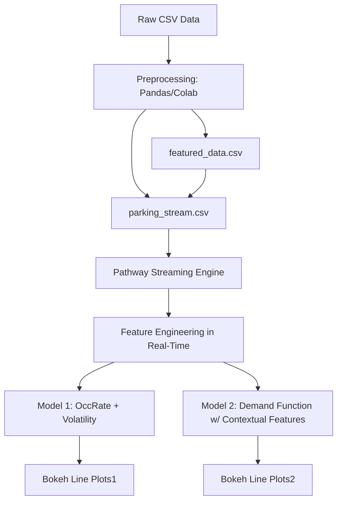
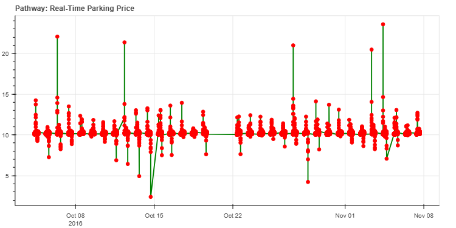
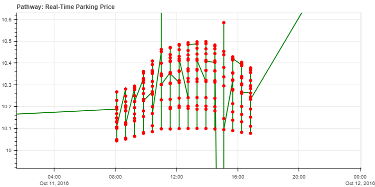
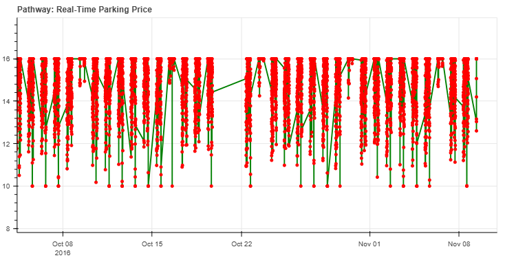
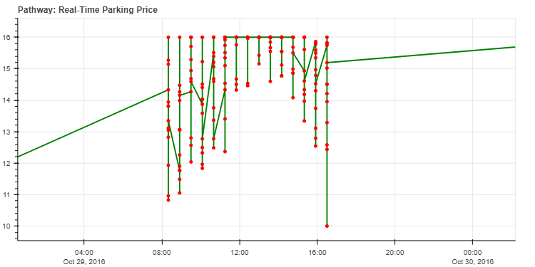

# **🚗 Dynamic Pricing for Urban Parking Lots**

#### Capstone Project of Summer Analytics 2025
#### hosted by Consulting & Analytics Club × Pathway
---
### 👨‍💻 Author: Ritam Mondal  <a href="https://www.linkedin.com/in/ritam-mondal-86a369287/" target="_blank"></a>  
🎓 B.Tech + M.Tech (Dual Degree), IIT Kharagpur '28  
📫 ritamm134@gmail.com  


---

## 🌐 Project Overview and problem statement
Urban parking spaces are a limited and highly demanded resource. Prices that remain static
throughout the day can lead to inefficiencies — either overcrowding or underutilization.
To improve utilization, dynamic pricing based on demand, competition, and real-time
conditions is crucial. 

This project implements a real-time dynamic pricing system for urban parking lots based on real-time occupancy, traffic, queue length, and contextual features. It utilizes Pathway for real-time stream processing, Bokeh for interactive visualizations, and Python/Colab for feature engineering and simulation.

The primary objective is to optimize parking lot pricing to balance supply and demand, improve space utilization, and ensure fairness during special conditions like traffic surges, special events, or vehicle-specific needs.

get data sets here:
- [Raw dataset.csv](Data_sets/Raw_data/dataset.csv)
- [Parkin_stream.csv](Data_sets/parking_stream.csv)

---

## 🪜 Tech Stack
- Python — core programming and preprocessing
- Google Colab — Jupyter-based development
- Pathway — real-time streaming and window-based computation
- Bokeh + Panel — interactive visualizations
- Pandas — preprocessing of initial data
- Git + GitHub — version control and collaboration

## 📁 Project Structure
```
Repositary/
├── Data_sets/  
│   ├── Raw_data/
│   |   └── dataset.csv            # Raw data
│   ├── featured_data.csv       # Processed features
│   └── parking_stream.csv      # Final streamable data
├── Model_1_imgs/                 # Bokeh plots for Model 1
│   ├── bokeh_plot1.png
|   └── bokeh_plot1_model.png
├── Model2_imgs/                   # Bokeh plots for Model 2
│   ├── bokeh_plot_model2.png
|   └── other_daywise and system wise_imgs.png
├── Dynamic_Pricing_Model_1.ipynb   # OccRate + Volatility model
├── Dynamic_Pricing_Model_2.ipynb   # Full-feature demand model
└── README.md
```
## 📊 Architecture & Workflow

---

## 🔄 Real-Time Simulation Logic
- Data ingestion via `replay_csv()` simulates delayed streaming
- Feature engineering:
   - `Occ_rate = Occupancy / Capacity`
   - `Volatility = (occ_max - occ_min) / Capacity`
   - `Demand rate = (max_occ - min_occ) / time_span`
  
- **Model 1** uses basic features for price estimation [Model1 Notebook](Dynamic_Pricing_Model_1.ipynb)

<table>
  <tr>
    <td></td>
    <td></td>  
  </tr>
</table>

   ```price = base_price + α * Occ_rate + demand_rate```
  - **Where:**
    - `base_price = 10`
    - `Occ_rate = Occupancy / Capacity`
    - `demand_rate = (latest_occ - earliest_occ) / 35`  ⬅️
    - `α = 0.5` (weight for Occ_rate)

---
- **Model 2** builds a linear demand function with weights for:  [Model2 Notebook](Dynamic_Pricing_Model_2.ipynb)

<table>
  <tr>
    <td></td>
    <td></td>
  </tr>
</table>

 check more [model2 day and systemwise plots](Model2_imgs)
                          
  - Queue Length
  - Traffic Level
  - Vehicle Type
  - Special Day
  - Demand Rate & Volatility
```
    demand_raw = (
          a * pw.this.occ_rate        # more full → more demand
        + b * pw.this.queue           # longer queue → more demand
        - c * traffic_norm            # traffic congestion reduces parking attractiveness
        + d * pw.this.special         # special event? raise demand
        + e * vehicle_weight          # heavier vehicle → more price willingness
        + f * demand_rate             # faster filling → higher urgency
        + g * volatility              # rapid fluctuation → higher scarcity signal  
    )
```
- `price` was capped between ₹8 and ₹20 for stability.

---

## 🔍 Insights & Visuals
- Price plots show clear spikes on high-demand days
- Most systems touch upper/lower caps, indicating extreme utilization
- Few intermediate prices suggest binary demand profile in systems
- Daily windowing offers cleaner trend visualization

---

> 🌟 *Designed and documented by **Ritam Mondal | [IIT Kharagpur]***


                 
